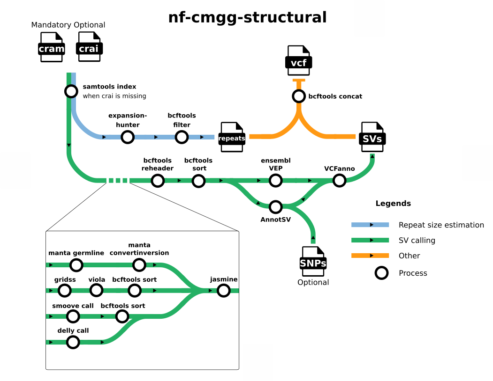

## Introduction

**nf-cmgg/structural** is a bioinformatics best-practice analysis pipeline for calling structural variants (SVs), copy number variants (CNVs) and repeat region expansions (RREs) from short DNA reads. The pipeline handles the calling of the variants and postprocessing (filtering, annotating...)

The pipeline is built using [Nextflow](https://www.nextflow.io), a workflow tool to run tasks across multiple compute infrastructures in a very portable manner. It uses Docker/Singularity containers making installation trivial and results highly reproducible. The [Nextflow DSL2](https://www.nextflow.io/docs/latest/dsl2.html) implementation of this pipeline uses one container per process which makes it much easier to maintain and update software dependencies. Where possible, these processes have been submitted to and installed from [nf-core/modules](https://github.com/nf-core/modules) in order to make them available to all Nextflow pipelines!



## Usage

!!! note

    If you are new to Nextflow and nf-core, please refer to [this page](https://nf-co.re/docs/usage/installation) on how
    to set-up Nextflow. Make sure to [test your setup](https://nf-co.re/docs/usage/introduction#how-to-run-a-pipeline)
    with `-profile test` before running the workflow on actual data.

Now, you can run the pipeline using:

```bash
nextflow run nf-cmgg/structural \
   -profile <docker/singularity/.../institute> \
   --input samplesheet.csv \
   --outdir <OUTDIR>
```

!!! warning
Please provide pipeline parameters via the CLI or Nextflow `-params-file` option. Custom config files including those
provided by the `-c` Nextflow option can be used to provide any configuration _**except for parameters**_;
see [docs](https://nf-co.re/usage/configuration#custom-configuration-files).

## Documentation

The nf-cmgg/structural pipeline comes with documentation about the pipeline [usage](usage.md) and [output](output.md).

!!! warning
Please provide pipeline parameters via the CLI or Nextflow `-params-file` option. Custom config files including those provided by the `-c` Nextflow option can be used to provide any configuration _**except for parameters**_;
see [docs](https://nf-co.re/usage/configuration#custom-configuration-files).

## Credits

nf-cmgg/structural was originally written by Nicolas Vannieuwkerke and Mattias Van Heetvelde.

## Contributions and Support

If you would like to contribute to this pipeline, please see the [contributing guidelines](https://github.com/nf-cmgg/structural/blob/dev/.github/CONTRIBUTING.md).

## Citations

<!-- If you use  nf-cmgg/structural for your analysis, please cite it using the following doi: [10.5281/zenodo.XXXXXX](https://doi.org/10.5281/zenodo.XXXXXX) -->

An extensive list of references for the tools used by the pipeline can be found in the [`Citations`](CITATIONS.md) section.
